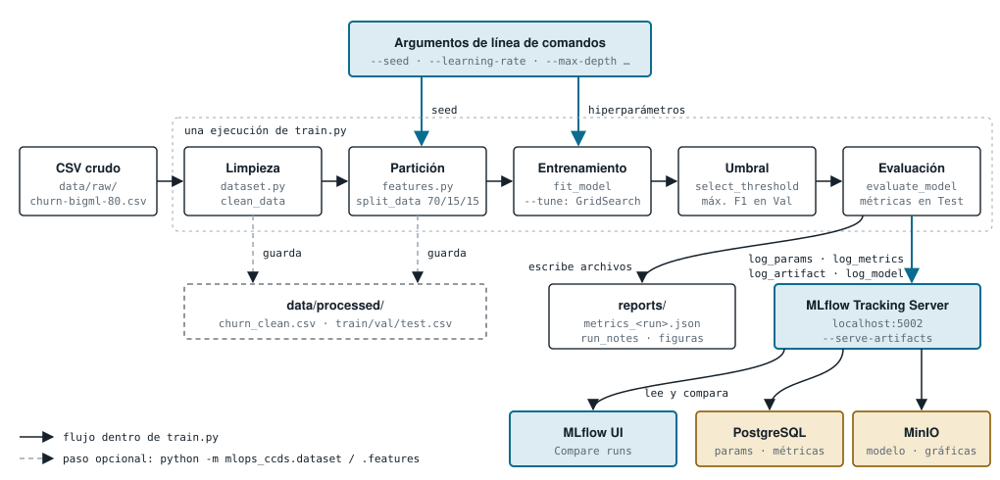

# mlops_ccds

<a target="_blank" href="https://cookiecutter-data-science.drivendata.org/">
    
</a>

Ejemplo ocupando MLOps y CCDS: predicción de churn en telecomunicaciones, con seguimiento de
experimentos en MLflow.

## Datos Generales

* **Alumno:** Luis Arturo Sánchez Davila
* **Matrícula:** A01840576
* **Materia:** Operaciones de aprendizaje automático (Gpo 10)
* **Actividad:** Actividad | Dataset - Notebook | Individual
* **Repositorio:** [GitHub ](https://github.com/sanchezdavilaluisarturo/mlops_ccds/tree/Separar_Actividad)

## Instalación

Requiere Python 3.12.

```bash
python3.12 -m venv .venv
source .venv/bin/activate
pip install -r requirements.txt
```

Servidor MLflow (PostgreSQL + MinIO) con Docker:

```bash
cp config.env.example config.env        # y llenar los valores
docker-compose --env-file config.env up -d --build
```

La interfaz queda en `http://localhost:5002`. El script usa esa dirección por defecto; se puede
cambiar con `MLFLOW_TRACKING_URI` en `.env`. Si el servidor no responde, el entrenamiento corre
igual y avisa que el run no se registró.

## Ejecución

```bash
python -m mlops_ccds.modeling.train            # sin argumentos: valores por defecto
python -m mlops_ccds.modeling.train --help     # lista completa de argumentos
```

| Argumento | Por defecto | Aplica a |
|---|---|---|
| `--seed` | 42 | partición, modelo y validación cruzada |
| `--model` | `hgb` | `hgb` (HistGradientBoosting) o `baseline` (LogisticRegression) |
| `--learning-rate` | 0.1 | hgb |
| `--max-depth` | 8 | hgb |
| `--max-leaf-nodes` | 31 | hgb |
| `--min-samples-leaf` | 20 | hgb |
| `--l2-regularization` | 1.5 | hgb |
| `--max-iter` | 250 (hgb) / 1000 (baseline) | ambos |
| `--C` | 1.0 | baseline |
| `--tune` / `--quick` | desactivado | búsqueda con GridSearchCV (`--quick`: rejilla mínima) |
| `--run-name`, `--no-log-to-mlflow` | | nombre del run; entrenar sin registrar |

Cada ejecución registra en MLflow los hiperparámetros (`log_params`), las métricas de validación y
Test, los artefactos (`evaluation_plots/` y `metadata/`) y el modelo (`mlflow.sklearn.log_model`).

## Flujo



Lo que pasa al ejecutar `python -m mlops_ccds.modeling.train`, en una sola corrida:

1. **Argumentos.** `--seed` fija la partición y los hiperparámetros definen el modelo.
2. **Limpieza** (`dataset.py`). Quita duplicados, convierte tipos, mapea Yes/No a 1/0 y elimina
   los cargos redundantes con los minutos.
3. **Partición** (`features.py`). 70/15/15 estratificado.
4. **Entrenamiento** (`train.py`). HistGradientBoosting o regresión logística; con `--tune` busca
   los hiperparámetros con GridSearchCV.
5. **Umbral.** El que maximiza F1 en Validación, nunca en Test.
6. **Evaluación.** Métricas sobre el Test ciego, guardadas en `reports/`.
7. **Registro.** Params, métricas, artefactos y modelo van al servidor MLflow, que guarda los
   metadatos en PostgreSQL y los artefactos en MinIO. Desde la interfaz se comparan los runs.

Los pasos de `dataset.py` y `features.py` también se pueden ejecutar por separado
(`python -m mlops_ccds.dataset` y `python -m mlops_ccds.features`) para dejar archivos
intermedios en `data/processed/`, pero `train.py` no los lee: recalcula la partición desde
`data/raw` con su propia semilla.

## Reproducibilidad

Dos ejecuciones con los mismos argumentos producen exactamente el mismo resultado.

**Cómo se fija la semilla.** `--seed` (42 por defecto) es la única fuente de azar y se pasa de
forma explícita a cada componente:

| Componente | Dónde |
|---|---|
| Partición estratificada 70/15/15 | `split_data(..., random_state=seed)` |
| Modelo (incluye la parada temprana de HGB) | `random_state=seed` en `HistGradientBoostingClassifier` y `LogisticRegression` |
| Validación cruzada de `--tune` | `StratifiedKFold(shuffle=True, random_state=seed)` |
| Generadores globales | `random.seed(seed)` y `np.random.seed(seed)` en `set_seed` |

La partición se recalcula en cada ejecución desde `data/raw/churn-bigml-80.csv`. No se lee de
`data/processed/`, para que el resultado dependa solo de los argumentos y del CSV, y no de
archivos intermedios generados con otra semilla.

**Cómo comprobarlo.** Cada ejecución escribe `reports/metrics_<run_name>.json` con las métricas a
precisión completa (también se sube a MLflow en `metadata/`):

```bash
python -m mlops_ccds.modeling.train --seed 42 --run-name r --no-log-to-mlflow
cp reports/metrics_r.json /tmp/a.json
python -m mlops_ccds.modeling.train --seed 42 --run-name r --no-log-to-mlflow
cmp reports/metrics_r.json /tmp/a.json && echo "idénticos"
```

Verificado con `hgb`, `baseline`, hiperparámetros distintos de los de por defecto y
`--tune --quick`: el JSON es idéntico byte a byte entre dos ejecuciones. Con semillas distintas
el resultado cambia.

**Qué sí cambia entre ejecuciones:** el `run_id`, las fechas y las rutas, que no son resultados.

**Límites.**
- Con 400 filas de Test y 58 casos de churn, la métrica varía bastante según la semilla
  (por ejemplo, ROC-AUC 0.852 con la semilla 42 y 0.905 con la 7 y otros hiperparámetros).
  Para comparar dos modelos, usa la misma semilla en ambos.
- La garantía vale con las versiones de `requirements.txt`. Otra versión de scikit-learn, NumPy
  u otra plataforma pueden cambiar los decimales. Se verificó en macOS con Python 3.12.4.

## Dependencias

`requirements.txt` fija la versión exacta (`==`) de cada librería con la que se entrenó y validó
el proyecto. El cliente de MLflow (3.17.0) coincide con el del servidor Docker.

Para actualizar: instalar las nuevas versiones, correr el entrenamiento y las pruebas, y volver a
fijar con `pip freeze` solo las librerías directas.

## Organización del proyecto

```
├── LICENSE
├── Makefile             <- Comandos: `make requirements`, `make data`, `make lint`,
│                           `make format` y `make test`
├── README.md
├── pyproject.toml       <- Metadatos del paquete (Python ~=3.12) y configuración de ruff
├── requirements.txt     <- Dependencias con versión exacta
├── docker-compose.yaml  <- Servidor MLflow: PostgreSQL + MinIO + tracking server
├── config.env.example   <- Variables del stack Docker; se copia a `config.env` (no se versiona)
├── .env                 <- Variables del cliente, p. ej. MLFLOW_TRACKING_URI (no se versiona)
│
├── mlflow
│   └── Dockerfile       <- Imagen del tracking server
│
├── data                 <- Ignorada por git
│   ├── external         <- Datos de terceros
│   ├── interim          <- Datos intermedios
│   ├── processed        <- Generados: churn_clean.csv y train/val/test.csv
│   └── raw              <- churn-bigml-80.csv, el original inmutable
│
├── docs                 <- Proyecto mkdocs (plantilla de ccds)
│
├── models               <- Modelos serializados (el modelo oficial vive en MLflow/MinIO)
│
├── notebooks
│   ├── 1.0-lsd-baseline-churn.ipynb    <- Notebook de la entrega original
│   ├── 1.1-lsd-churn-refactored.ipynb  <- Misma lógica en clases (DataExplorer,
│   │                                      ChurnDataset, ChurnModel)
│   └── Semana3                         <- Notas de corridas anteriores
│
├── references           <- Diccionarios de datos y material de apoyo
│
├── reports              <- Se genera al ejecutar los scripts
│   ├── figures          <- Gráficas del EDA y de evaluación de cada run
│   ├── metrics_<run>.json   <- Métricas a precisión completa (compara ejecuciones)
│   └── run_notes_<run>.txt  <- Resumen de cada corrida
│
├── tests
│   └── test_data.py     <- Pendiente: sigue la plantilla de ccds (assert False)
│
└── mlops_ccds           <- Código fuente
    ├── __init__.py
    ├── config.py        <- Rutas y constantes: columnas, semilla, particiones, MLflow
    ├── dataset.py       <- load_raw y clean_data; guarda data/processed/churn_clean.csv
    ├── features.py      <- split_data (70/15/15 estratificado), build_preprocessor
    ├── plots.py         <- Gráficas del EDA y diagnóstico del modelo (ROC, PR, confusión)
    └── modeling
        ├── __init__.py
        ├── predict.py   <- Plantilla de ccds, sin implementar
        └── train.py     <- Entrenamiento, umbral, evaluación y registro en MLflow
```

Flujo de los scripts: `dataset.py` (limpieza) → `features.py` (particiones) → `train.py`
(modelo y MLflow). `train.py` no depende de los pasos anteriores: recalcula la partición desde
`data/raw` con su propia semilla.

--------

## Referencias

### Bibliografía

- Ascarza, E., Neslin, S. A., Netzer, O., Anderson, Z., Fader, P. S., Gupta, S., Lattin, J. M.,
  Lemmens, A., Libai, B., Neal, M. B., Neslin, S. A., & Yildiz, E. (2018). In pursuit of enhanced
  customer retention management: Review, key issues, and future directions. *Customer Needs and
  Solutions*, *5*(1–2), 65–81. https://doi.org/10.1007/s40547-017-0080-0
- Kreuzberger, D., Kühl, N., & Hirschl, S. (2023). Machine learning operations (MLOps): Overview,
  definition, and architecture. *IEEE Access*, *11*, 31866–31879.
  https://doi.org/10.1109/ACCESS.2023.3262138
- Pedregosa, F., Varoquaux, G., Gramfort, A., Michel, V., Thirion, B., Grisel, O., Blondel, M.,
  Prettenhofer, P., Weiss, R., Dubourg, V., Vanderplas, J., Passos, A., Cournapeau, D., Brucher,
  M., Perrot, M., & Duchesnay, É. (2011). Scikit-learn: Machine learning in Python. *Journal of
  Machine Learning Research*, *12*, 2825–2830.
- Zaharia, M., Chen, A., Davidson, A., Ghodsi, A., Hong, S. A., Konwinski, A., Murching, S.,
  Nykodym, T., Ogilvie, P., Parkhe, M., Xie, F., & Zumar, C. (2018). Accelerating the machine
  learning lifecycle with MLflow. *IEEE Data Engineering Bulletin*, *41*(4), 39–45.

### Datos

- Nasri, M. *Telecom Churn Datasets* (`churn-bigml-80.csv`). Kaggle.
  https://www.kaggle.com/datasets/mnassrib/telecom-churn-datasets

### Documentación de las herramientas

- Cookiecutter Data Science (estructura del proyecto):
  https://cookiecutter-data-science.drivendata.org/
- MLflow Tracking: https://mlflow.org/docs/latest/
- scikit-learn, `HistGradientBoostingClassifier`:
  https://scikit-learn.org/stable/modules/generated/sklearn.ensemble.HistGradientBoostingClassifier.html
- scikit-learn, `LogisticRegression`:
  https://scikit-learn.org/stable/modules/generated/sklearn.linear_model.LogisticRegression.html
- scikit-learn, control del azar (semillas y reproducibilidad):
  https://scikit-learn.org/stable/common_pitfalls.html#controlling-randomness
- Typer (línea de comandos): https://typer.tiangolo.com/
- Docker Compose: https://docs.docker.com/compose/
- PostgreSQL: https://www.postgresql.org/docs/
- MinIO: https://min.io/docs/minio/linux/index.html

### Herramientas de IA

- Anthropic. (2026). *Claude Code* [Herramienta de línea de comandos] con el modelo Claude
  Sonnet 5.5. https://claude.com/claude-code. Se usó para generar el diagrama de la sección
  Flujo (`docs/docs/img/flujo.svg`) mediante la herramienta Artifact y su skill
  `artifact-diagramming` (guía para dibujar diagramas en SVG que muestran el mecanismo y no solo
  los nombres de los componentes). La página interactiva del diagrama siguió además el skill
  `artifact-design`.
- Anthropic. (2026). *Claude Code* [Herramienta de línea de comandos] con el modelo Claude
  Sonnet 5.5. https://claude.com/claude-code. Se usó para la limpieza y refactorización del
  código y para agregar comentarios a nivel de código:
