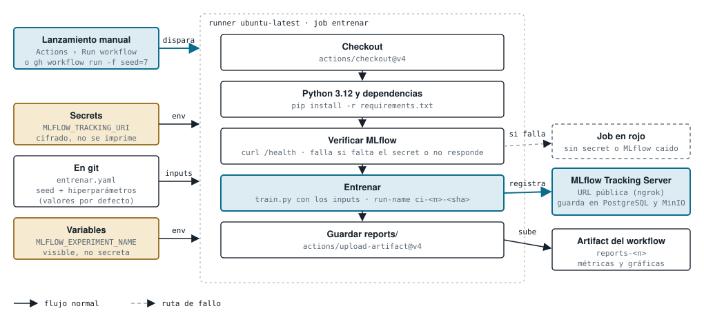
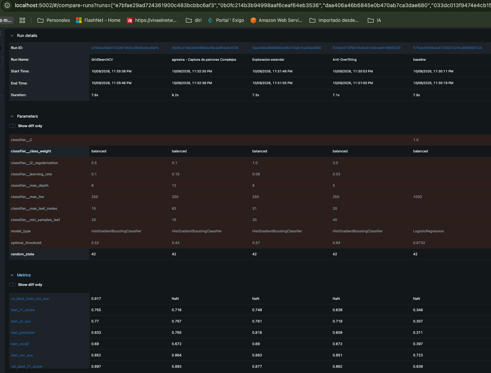
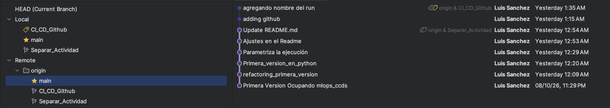

# mlops_ccds

<a target="_blank" href="https://cookiecutter-data-science.drivendata.org/">
    
</a>

Ejemplo ocupando MLOps y CCDS: predicción de churn en telecomunicaciones, con seguimiento de
experimentos en MLflow.

## Datos Generales

* **Alumno:** Luis Arturo Sánchez Davila
* **Matrícula:** A01840576
* **Materia:** Operaciones de aprendizaje automático (Gpo 10)
* **Actividad:** Actividad Individual | Código de experimentación base con MLFlow
* **Repositorio:** [GitHub ](https://github.com/sanchezdavilaluisarturo/mlops_ccds/tree/Separar_Actividad)
* 

## Índice

- [Instalación](#instalación)
- [Ejecución](#ejecución)
- [Flujo](#flujo)
- [GitHub Actions](#github-actions)
  - [Dónde vive cada valor](#dónde-vive-cada-valor)
  - [Cómo agregar el secret y la variable](#cómo-agregar-el-secret-y-la-variable)
  - [Cómo lanzarlo](#cómo-lanzarlo)
  - [Requisitos y límites](#requisitos-y-límites)
  - [Corridas registradas desde GitHub Actions](#corridas-registradas-desde-github-actions)
  - [Comparación de modelos y mejor modelo](#comparación-de-modelos-y-mejor-modelo)
- [Ramas y control de versiones](#ramas-y-control-de-versiones)
- [Reproducibilidad](#reproducibilidad)
- [Dependencias](#dependencias)
- [Organización del proyecto](#organización-del-proyecto)
- [Referencias](#referencias)


## Instalación

Requiere Python 3.12.

```bash
python3.12 -m venv .venv
source .venv/bin/activate
pip install -r requirements.txt
```

Servidor MLflow (PostgreSQL + MinIO) con Docker:

```bash
cp config.env.example config.env        # y llenar los valores
docker-compose --env-file config.env up -d --build
```

La interfaz queda en `http://localhost:5002`. El script usa esa dirección por defecto; se puede
cambiar con `MLFLOW_TRACKING_URI` en `.env`. Si el servidor no responde, el entrenamiento corre
igual y avisa que el run no se registró.

Para exponer el servidor fuera de tu máquina (necesario para GitHub Actions o para registrar
desde un notebook en otro equipo) se abre un túnel con ngrok hacia el puerto de MLflow:

```bash
ngrok http 5002 --host-header="localhost:5002"
```

`--host-header` reescribe el `Host` de cada petición a `localhost:5002`. La URL pública que
muestra ngrok es la que se guarda como secret `MLFLOW_TRACKING_URI` (ver GitHub Actions). Su
dominio debe coincidir con `MLFLOW_SERVER_ALLOWED_ORIGINS` y `--cors-allowed-origins` en
`docker-compose.yaml`; si cambia, hay que actualizarlo ahí y reiniciar el contenedor de MLflow.

## Ejecución

```bash
python -m mlops_ccds.modeling.train            # sin argumentos: valores por defecto
python -m mlops_ccds.modeling.train --help     # lista completa de argumentos
```

| Argumento | Por defecto | Aplica a |
|---|---|---|
| `--seed` | 42 | partición, modelo y validación cruzada |
| `--model` | `hgb` | `hgb` (HistGradientBoosting) o `baseline` (LogisticRegression) |
| `--learning-rate` | 0.1 | hgb |
| `--max-depth` | 8 | hgb |
| `--max-leaf-nodes` | 31 | hgb |
| `--min-samples-leaf` | 20 | hgb |
| `--l2-regularization` | 1.5 | hgb |
| `--max-iter` | 250 (hgb) / 1000 (baseline) | ambos |
| `--C` | 1.0 | baseline |
| `--tune` / `--quick` | desactivado | búsqueda con GridSearchCV (`--quick`: rejilla mínima) |
| `--run-name`, `--no-log-to-mlflow` | | nombre del run; entrenar sin registrar |

Cada ejecución registra en MLflow los hiperparámetros (`log_params`), las métricas de validación y
Test, los artefactos (`evaluation_plots/` y `metadata/`) y el modelo (`mlflow.sklearn.log_model`).

## Flujo


Lo que pasa al ejecutar `python -m mlops_ccds.modeling.train`, en una sola corrida:

1. **Argumentos.** `--seed` fija la partición y los hiperparámetros definen el modelo.
2. **Limpieza** (`dataset.py`). Quita duplicados, convierte tipos, mapea Yes/No a 1/0 y elimina
   los cargos redundantes con los minutos.
3. **Partición** (`features.py`). 70/15/15 estratificado.
4. **Entrenamiento** (`train.py`). HistGradientBoosting o regresión logística; con `--tune` busca
   los hiperparámetros con GridSearchCV.
5. **Umbral.** El que maximiza F1 en Validación, nunca en Test.
6. **Evaluación.** Métricas sobre el Test ciego, guardadas en `reports/`.
7. **Registro.** Params, métricas, artefactos y modelo van al servidor MLflow, que guarda los
   metadatos en PostgreSQL y los artefactos en MinIO. Desde la interfaz se comparan los runs.

Los pasos de `dataset.py` y `features.py` también se pueden ejecutar por separado
(`python -m mlops_ccds.dataset` y `python -m mlops_ccds.features`) para dejar archivos
intermedios en `data/processed/`, pero `train.py` no los lee: recalcula la partición desde
`data/raw` con su propia semilla.

## GitHub Actions



El workflow `.github/workflows/entrenar.yaml` solo entrena y registra el run en MLflow; Se lanza a mano. Antes de entrenar comprueba que el servidor MLflow
responda: si falta el secret o el servidor no contesta, el job termina en rojo en vez de
entrenar sin registrar el run.

### Dónde vive cada valor

| Valor | Dónde | Por qué |
|---|---|---|
| `seed` e hiperparámetros | Inputs de `entrenar.yaml` (en git) | No son secretos y quedan versionados con el commit |
| `MLFLOW_TRACKING_URI` | Secret | La URL pública del servidor no debe escribirse en el repositorio |
| `MLFLOW_EXPERIMENT_NAME` | Variable | Es configuración visible; si no existe se usa `Churn_Test_Telco_v1` |

Las credenciales del servidor (PostgreSQL y MinIO) no se usan en el CI: solo las necesita el
`docker-compose`. El cliente habla únicamente con MLflow.

### Cómo agregar el secret y la variable

1. En GitHub, abre el repositorio: **Settings › Secrets and variables › Actions**.
2. Pestaña **Secrets › New repository secret**. Nombre: `MLFLOW_TRACKING_URI`. Valor: la URL
   pública de tu servidor MLflow (por ejemplo, la de ngrok).
3. Pestaña **Variables › New repository variable**. Nombre: `MLFLOW_EXPERIMENT_NAME`. Valor:
   `Churn_Test_Telco_v1`.

Con la terminal, usando [GitHub CLI](https://cli.github.com/) (`brew install gh` y
`gh auth login` una sola vez):

```bash
gh secret set MLFLOW_TRACKING_URI      # pide el valor; no queda en el historial del shell
gh variable set MLFLOW_EXPERIMENT_NAME --body "Churn_Test_Telco_v1"
gh secret list && gh variable list     # comprobar (los secrets no muestran su valor)
```

Si el servidor MLflow tuviera autenticación, se agregarían igual como secrets
`MLFLOW_TRACKING_USERNAME` y `MLFLOW_TRACKING_PASSWORD`, y se pasarían en el `env:` del job.

### Cómo lanzarlo

En **Actions › Entrenamiento › Run workflow** se eligen los inputs (modelo, semilla,
hiperparámetros, `tune`) y se pulsa el botón. Con la terminal:

```bash
gh workflow run entrenar.yaml -f run_name=HGB_cli_v2 -f seed=7 -f learning_rate=0.05
```

El nombre del run en MLflow se elige con el input `run_name` (por ejemplo `HGB_cli_v2`). Si se
deja vacío, `train.py` usa su nombre por defecto (`HistGradientBoosting`,
`HistGradientBoosting_FineTuned` con `tune`, o `Baseline_LogisticRegression`). Como los runs
pueden repetir nombre, conviene cambiarlo en cada ejecución para distinguirlos. La carpeta
`reports/` queda como artifact de la ejecución.

### Requisitos y límites

- El runner de GitHub no ve `localhost:5002`. El secret debe ser una URL pública, y el túnel
  (ngrok) y el servidor Docker deben estar encendidos al lanzar el workflow.
- El botón **Run workflow** solo aparece si el archivo está en la rama principal del
  repositorio. Mientras viva en otra rama hay que integrarlo con un pull request.
- El dataset no está en git (`data/` se ignora): el runner lo descarga con `kagglehub`. Si pide
  credenciales, hay que agregar `KAGGLE_USERNAME` y `KAGGLE_KEY` como secrets.
- La semilla garantiza el mismo resultado con las mismas versiones de `requirements.txt`. El
  runner es Linux y la verificación se hizo en macOS, así que los decimales pueden diferir.

### Corridas registradas desde GitHub Actions

Los runs que se ven en MLflow se lanzaron desde este workflow (no desde la terminal local),
cambiando los inputs de `entrenar.yaml`. Cada columna es un run; `classifier__*` son los
hiperparámetros que quedan en `log_params`:

| Run Name | Modelo | `learning_rate` | `max_depth` | `max_leaf_nodes` | `min_samples_leaf` | `l2_regularization` | `optimal_threshold` |
|---|---|---|---|---|---|---|---|
| `GridSearchCV` | HistGradientBoosting | 0.1 | 6 | 15 | 20 | 0.5 | 0.52 |
| `agresiva - Captura de patrones Complejos` | HistGradientBoosting | 0.15 | 12 | 63 | 10 | 0.1 | 0.43 |
| `Exploracion estandar` | HistGradientBoosting | 0.08 | 8 | 31 | 20 | 1.0 | 0.57 |
| `Anti-Overfitting` | HistGradientBoosting | 0.03 | 5 | 20 | 40 | 3.0 | 0.64 |
| `baseline` | LogisticRegression (`C=1.0`, `max_iter=1000`) | — | — | — | — | — | 0.6732 |

Todos usan `class_weight=balanced` y `max_iter=250` (salvo el baseline). El nombre de cada run
sale del input `run_name`. `GridSearchCV` es la corrida con `tune` activado, por eso sus
hiperparámetros son los que eligió la búsqueda y no los valores por defecto del workflow. En la
interfaz de MLflow se comparan seleccionando los runs y pulsando **Compare**.

### Comparación de modelos y mejor modelo

Métricas de los mismos cinco runs. Las de `test_*` se calculan sobre el conjunto de prueba con el
umbral óptimo de cada run; `val_best_f1_score` es el F1 en validación con ese umbral:

| Métrica | 🏆 `GridSearchCV` | `agresiva` | `Exploracion estandar` | `Anti-Overfitting` | `baseline` |
|---|---|---|---|---|---|
| `cv_best_train_roc_auc` | **0.917** | NaN | NaN | NaN | NaN |
| `test_f1_score` | **0.755** | 0.716 | 0.748 | 0.639 | 0.348 |
| `test_pr_auc` | **0.770** | 0.767 | 0.761 | 0.719 | 0.307 |
| `test_precision` | **0.833** | 0.765 | 0.816 | 0.609 | 0.311 |
| `test_recall` | 0.690 | 0.672 | 0.690 | 0.672 | 0.397 |
| `test_roc_auc` | 0.852 | **0.864** | 0.863 | 0.851 | 0.723 |
| `val_best_f1_score` | **0.897** | 0.893 | 0.877 | 0.862 | 0.639 |

> 🏆 **Mejor modelo: `GridSearchCV`** (HistGradientBoosting con `learning_rate=0.1`, `max_depth=6`,
> `max_leaf_nodes=15`, `min_samples_leaf=20`, `l2_regularization=0.5`, umbral `0.52`).
> F1 de prueba **0.755**, PR-AUC **0.770**, precisión **0.833**.

Es el mejor en F1, PR-AUC y precisión de prueba y en F1 de
validación, y empata en recall con `Exploracion estandar`. Solo pierde en `test_roc_auc`
(0.852 frente a 0.864 de `agresiva`), una diferencia pequeña. Como el churn es una clase
minoritaria, F1 y PR-AUC son más informativas que ROC-AUC. `cv_best_train_roc_auc` solo existe
en este run porque es el único que hizo validación cruzada (`NaN` en los demás significa que
no se registró, no que fallara). El `baseline` queda muy por debajo (F1 0.348), lo que justifica
usar un modelo de boosting.

#### Comprobación en MLflow

Captura de la vista **Compare** del servidor MLflow (`localhost:5002`) con los cinco runs: los
parámetros, las métricas y las fechas de ejecución llegaron al servidor desde el workflow.



## Ramas y control de versiones

El trabajo se separó en ramas en GitHub y al final todo se integró a `main`, que es la rama
productiva (la única desde la que aparece el botón **Run workflow**):

| Rama | Contenido |
|---|---|
| `main` | Base del proyecto con la plantilla CCDS (`Primera Version Ocupando mlops_ccds`) y rama productiva final |
| `Separar_Actividad` | Refactor de la actividad en clases y módulos (`refactoring_primera_version`, `Primera_version_en_python`, `Parametriza la ejecución`) y ajustes del README |
| `CI_CD_Github` | Configuración de GitHub Actions (`adding github`) y el input `run_name` (`agregando nombre del run`) |

`CI_CD_Github` salió de `Separar_Actividad`, así que sus commits incluyen los del refactor. La
integración a `main` se hizo con pull requests: el
[#1](https://github.com/sanchezdavilaluisarturo/mlops_ccds/pull/1) y el
[#2](https://github.com/sanchezdavilaluisarturo/mlops_ccds/pull/2), ambos desde `CI_CD_Github`.



## Reproducibilidad

Dos ejecuciones con los mismos argumentos producen exactamente el mismo resultado.

**Cómo se fija la semilla.** `--seed` (42 por defecto) es la única fuente de azar y se pasa de
forma explícita a cada componente:

| Componente | Dónde |
|---|---|
| Partición estratificada 70/15/15 | `split_data(..., random_state=seed)` |
| Modelo (incluye la parada temprana de HGB) | `random_state=seed` en `HistGradientBoostingClassifier` y `LogisticRegression` |
| Validación cruzada de `--tune` | `StratifiedKFold(shuffle=True, random_state=seed)` |
| Generadores globales | `random.seed(seed)` y `np.random.seed(seed)` en `set_seed` |

La partición se recalcula en cada ejecución desde `data/raw/churn-bigml-80.csv`. No se lee de
`data/processed/`, para que el resultado dependa solo de los argumentos y del CSV, y no de
archivos intermedios generados con otra semilla.

**Cómo comprobarlo.** Cada ejecución escribe `reports/metrics_<run_name>.json` con las métricas a
precisión completa (también se sube a MLflow en `metadata/`):

```bash
python -m mlops_ccds.modeling.train --seed 42 --run-name r --no-log-to-mlflow
cp reports/metrics_r.json /tmp/a.json
python -m mlops_ccds.modeling.train --seed 42 --run-name r --no-log-to-mlflow
cmp reports/metrics_r.json /tmp/a.json && echo "idénticos"
```

Verificado con `hgb`, `baseline`, hiperparámetros distintos de los de por defecto y
`--tune --quick`: el JSON es idéntico byte a byte entre dos ejecuciones. Con semillas distintas
el resultado cambia.

**Qué sí cambia entre ejecuciones:** el `run_id`, las fechas y las rutas, que no son resultados.

**Límites.**
- Con 400 filas de Test y 58 casos de churn, la métrica varía bastante según la semilla
  (por ejemplo, ROC-AUC 0.852 con la semilla 42 y 0.905 con la 7 y otros hiperparámetros).
  Para comparar dos modelos, usa la misma semilla en ambos.
- La garantía vale con las versiones de `requirements.txt`. Otra versión de scikit-learn, NumPy
  u otra plataforma pueden cambiar los decimales. Se verificó en macOS con Python 3.12.4.

## Dependencias

`requirements.txt` fija la versión exacta (`==`) de cada librería con la que se entrenó y validó
el proyecto. El cliente de MLflow (3.17.0) coincide con el del servidor Docker.

Para actualizar: instalar las nuevas versiones, correr el entrenamiento y las pruebas, y volver a
fijar con `pip freeze` solo las librerías directas.

## Organización del proyecto

```
├── LICENSE
├── Makefile             <- Comandos: `make requirements`, `make data`, `make lint`,
│                           `make format` y `make test`
├── README.md
├── pyproject.toml       <- Metadatos del paquete (Python ~=3.12) y configuración de ruff
├── requirements.txt     <- Dependencias con versión exacta
├── docker-compose.yaml  <- Servidor MLflow: PostgreSQL + MinIO + tracking server
├── config.env.example   <- Variables del stack Docker; se copia a `config.env` (no se versiona)
├── .env                 <- Variables del cliente, p. ej. MLFLOW_TRACKING_URI (no se versiona)
│
├── mlflow
│   └── Dockerfile       <- Imagen del tracking server
│
├── data                 <- Ignorada por git
│   ├── external         <- Datos de terceros
│   ├── interim          <- Datos intermedios
│   ├── processed        <- Generados: churn_clean.csv y train/val/test.csv
│   └── raw              <- churn-bigml-80.csv, el original inmutable
│
├── docs                 <- Proyecto mkdocs (plantilla de ccds)
│
├── models               <- Modelos serializados (el modelo oficial vive en MLflow/MinIO)
│
├── notebooks
│   ├── 1.0-lsd-baseline-churn.ipynb    <- Notebook de la entrega Semana 3
│   ├── 1.1-lsd-churn-refactored.ipynb  <- Misma lógica en clases (DataExplorer,
│   │                                      ChurnDataset, ChurnModel)
│   └── Semana3                         <- Notas de corridas anteriores
│
├── references           <- Diccionarios de datos y material de apoyo
│
├── reports              <- Se genera al ejecutar los scripts
│   ├── figures          <- Gráficas del EDA y de evaluación de cada run
│   ├── metrics_<run>.json   <- Métricas a precisión completa (compara ejecuciones)
│   └── run_notes_<run>.txt  <- Resumen de cada corrida
│
├── tests
│   └── test_data.py     <- Pendiente: sigue la plantilla de ccds (assert False)
│
└── mlops_ccds           <- Código fuente
    ├── __init__.py
    ├── config.py        <- Rutas y constantes: columnas, semilla, particiones, MLflow
    ├── dataset.py       <- load_raw y clean_data; guarda data/processed/churn_clean.csv
    ├── features.py      <- split_data (70/15/15 estratificado), build_preprocessor
    ├── plots.py         <- Gráficas del EDA y diagnóstico del modelo (ROC, PR, confusión)
    └── modeling
        ├── __init__.py
        ├── predict.py   <- Plantilla de ccds, sin implementar
        └── train.py     <- Entrenamiento, umbral, evaluación y registro en MLflow
```

Flujo de los scripts: `dataset.py` (limpieza) → `features.py` (particiones) → `train.py`
(modelo y MLflow). `train.py` no depende de los pasos anteriores: recalcula la partición desde
`data/raw` con su propia semilla.

--------

## Referencias

### Bibliografía

- Ascarza, E., Neslin, S. A., Netzer, O., Anderson, Z., Fader, P. S., Gupta, S., Lattin, J. M.,
  Lemmens, A., Libai, B., Neal, M. B., Neslin, S. A., & Yildiz, E. (2018). In pursuit of enhanced
  customer retention management: Review, key issues, and future directions. *Customer Needs and
  Solutions*, *5*(1–2), 65–81. https://doi.org/10.1007/s40547-017-0080-0
- Kreuzberger, D., Kühl, N., & Hirschl, S. (2023). Machine learning operations (MLOps): Overview,
  definition, and architecture. *IEEE Access*, *11*, 31866–31879.
  https://doi.org/10.1109/ACCESS.2023.3262138
- Pedregosa, F., Varoquaux, G., Gramfort, A., Michel, V., Thirion, B., Grisel, O., Blondel, M.,
  Prettenhofer, P., Weiss, R., Dubourg, V., Vanderplas, J., Passos, A., Cournapeau, D., Brucher,
  M., Perrot, M., & Duchesnay, É. (2011). Scikit-learn: Machine learning in Python. *Journal of
  Machine Learning Research*, *12*, 2825–2830.
- Zaharia, M., Chen, A., Davidson, A., Ghodsi, A., Hong, S. A., Konwinski, A., Murching, S.,
  Nykodym, T., Ogilvie, P., Parkhe, M., Xie, F., & Zumar, C. (2018). Accelerating the machine
  learning lifecycle with MLflow. *IEEE Data Engineering Bulletin*, *41*(4), 39–45.

### Datos

- Nasri, M. *Telecom Churn Datasets* (`churn-bigml-80.csv`). Kaggle.
  https://www.kaggle.com/datasets/mnassrib/telecom-churn-datasets

### Documentación de las herramientas

- Cookiecutter Data Science (estructura del proyecto):
  https://cookiecutter-data-science.drivendata.org/
- MLflow Tracking: https://mlflow.org/docs/latest/
- scikit-learn, `HistGradientBoostingClassifier`:
  https://scikit-learn.org/stable/modules/generated/sklearn.ensemble.HistGradientBoostingClassifier.html
- scikit-learn, `LogisticRegression`:
  https://scikit-learn.org/stable/modules/generated/sklearn.linear_model.LogisticRegression.html
- scikit-learn, control del azar (semillas y reproducibilidad):
  https://scikit-learn.org/stable/common_pitfalls.html#controlling-randomness
- Typer (línea de comandos): https://typer.tiangolo.com/
- Docker Compose: https://docs.docker.com/compose/
- PostgreSQL: https://www.postgresql.org/docs/
- MinIO: https://min.io/docs/minio/linux/index.html

### Herramientas de IA

- Anthropic. (2026). *Claude Code* [Herramienta de línea de comandos] con el modelo Claude
  Sonnet 5.5. https://claude.com/claude-code. Se usó para generar el diagrama de la sección
  Flujo (`docs/docs/img/flujo.svg`) y de la sección GitHub Actions
  (`docs/docs/img/ci_cd.svg`) mediante la herramienta Artifact y su skill
  `artifact-diagramming` (guía para dibujar diagramas en SVG que muestran el mecanismo y no solo
  los nombres de los componentes). La página interactiva del diagrama siguió además el skill
  `artifact-design`.
- Anthropic. (2026). *Claude Code* [Herramienta de línea de comandos] con el modelo Claude
  Sonnet 5.5. https://claude.com/claude-code. Se usó para la limpieza y refactorización del
  código, comentarios a nivel de código y creación de README. 
